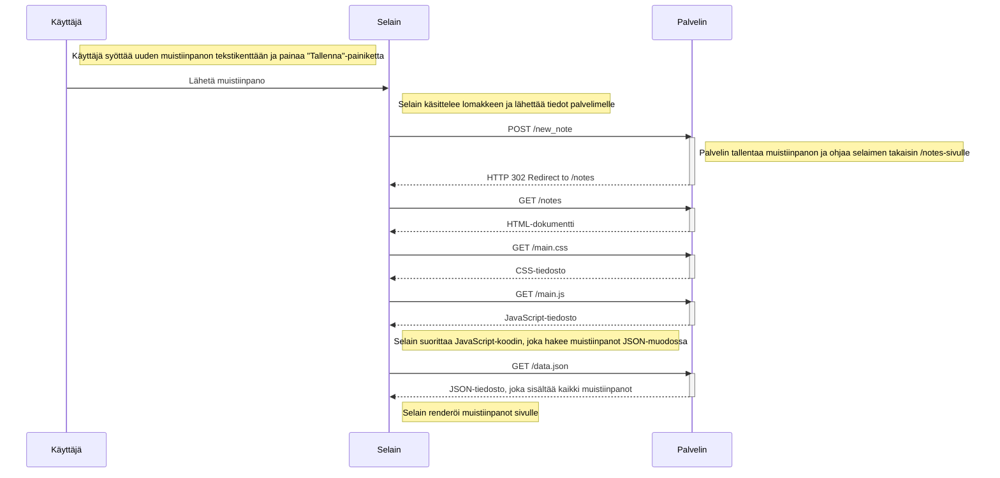

```mermaid
sequenceDiagram
    participant Käyttäjä
    participant Selain
    participant Palvelin

    Note right of Käyttäjä: Käyttäjä syöttää uuden muistiinpanon tekstikenttään ja painaa "Tallenna"-painiketta

    Käyttäjä->>Selain: Lähetä muistiinpano
    Note right of Selain: Selain käsittelee lomakkeen ja lähettää tiedot palvelimelle

    Selain->>Palvelin: POST /new_note
    activate Palvelin
    Note right of Palvelin: Palvelin tallentaa muistiinpanon ja ohjaa selaimen takaisin /notes-sivulle
    Palvelin-->>Selain: HTTP 302 Redirect to /notes
    deactivate Palvelin

    Selain->>Palvelin: GET /notes
    activate Palvelin
    Palvelin-->>Selain: HTML-dokumentti
    deactivate Palvelin

    Selain->>Palvelin: GET /main.css
    activate Palvelin
    Palvelin-->>Selain: CSS-tiedosto
    deactivate Palvelin

    Selain->>Palvelin: GET /main.js
    activate Palvelin
    Palvelin-->>Selain: JavaScript-tiedosto
    deactivate Palvelin

    Note right of Selain: Selain suorittaa JavaScript-koodin, joka hakee muistiinpanot JSON-muodossa

    Selain->>Palvelin: GET /data.json
    activate Palvelin
    Palvelin-->>Selain: JSON-tiedosto, joka sisältää kaikki muistiinpanot
    deactivate Palvelin

    Note right of Selain: Selain renderöi muistiinpanot sivulle
```
