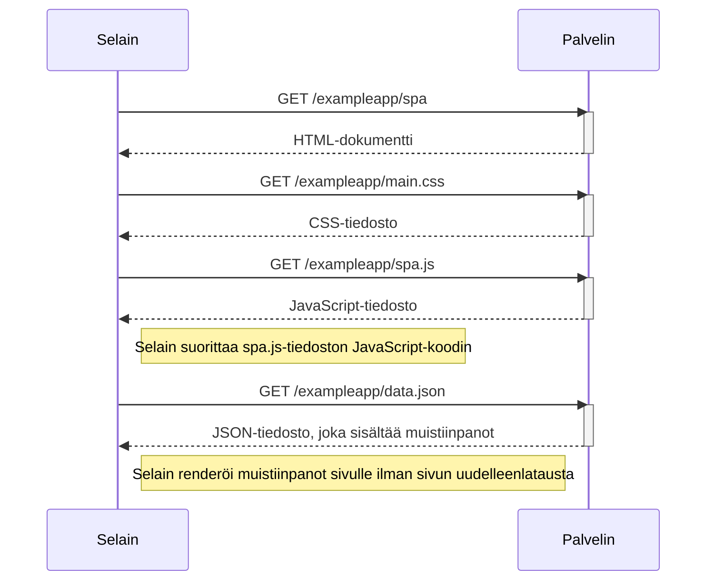

```mermaid
sequenceDiagram
    participant Selain
    participant Palvelin

    Selain->>Palvelin: GET /exampleapp/spa
    activate Palvelin
    Palvelin-->>Selain: HTML-dokumentti
    deactivate Palvelin

    Selain->>Palvelin: GET /exampleapp/main.css
    activate Palvelin
    Palvelin-->>Selain: CSS-tiedosto
    deactivate Palvelin

    Selain->>Palvelin: GET /exampleapp/spa.js
    activate Palvelin
    Palvelin-->>Selain: JavaScript-tiedosto
    deactivate Palvelin

    Note right of Selain: Selain suorittaa spa.js-tiedoston JavaScript-koodin

    Selain->>Palvelin: GET /exampleapp/data.json
    activate Palvelin
    Palvelin-->>Selain: JSON-tiedosto, joka sisältää muistiinpanot
    deactivate Palvelin

    Note right of Selain: Selain renderöi muistiinpanot sivulle ilman sivun uudelleenlatausta
```
