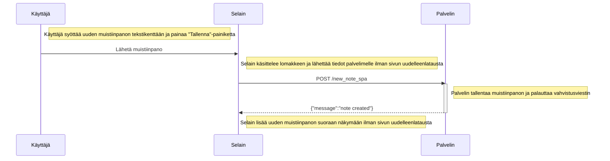

```mermaid
sequenceDiagram
    participant Käyttäjä
    participant Selain
    participant Palvelin

    Note right of Käyttäjä: Käyttäjä syöttää uuden muistiinpanon tekstikenttään ja painaa "Tallenna"-painiketta

    Käyttäjä->>Selain: Lähetä muistiinpano
    Note right of Selain: Selain käsittelee lomakkeen ja lähettää tiedot palvelimelle ilman sivun uudelleenlatausta

    Selain->>Palvelin: POST /new_note_spa
    activate Palvelin
    Note right of Palvelin: Palvelin tallentaa muistiinpanon ja palauttaa vahvistusviestin
    Palvelin-->>Selain: {"message":"note created"}
    deactivate Palvelin

    Note right of Selain: Selain lisää uuden muistiinpanon suoraan näkymään ilman sivun uudelleenlatausta
```
